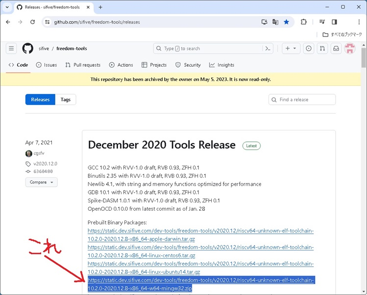
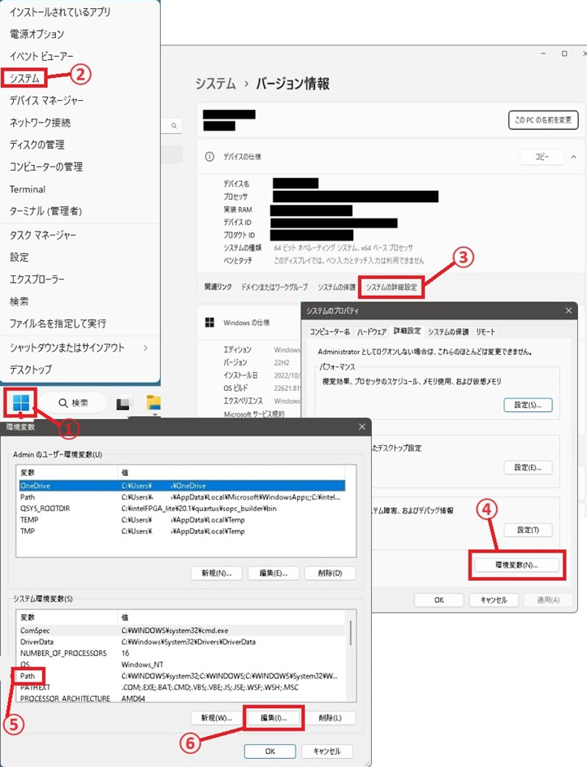
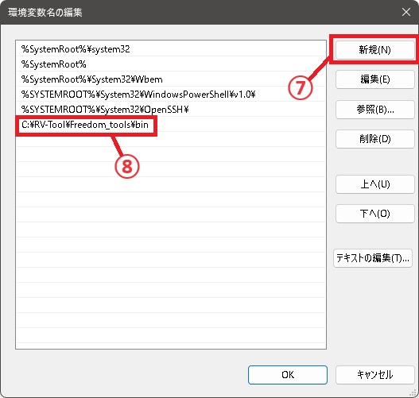
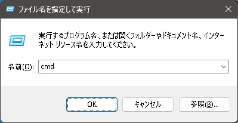
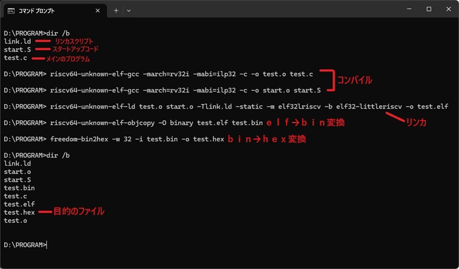
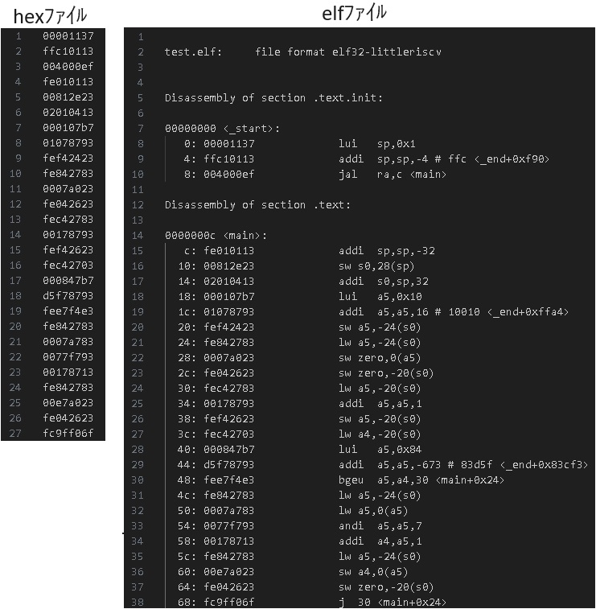

# WindowsでRISC-Vをコンパイルする
====

　FPGA上で動作するRISC-Vソフトコアで使用するHEXファイルのビルドの方法を紹介。  
　WindowsでRISC-Vをコンパイルしようと検索してみると、UbuntuとかWSLを使う方法が紹介されてますが、結局、Linuxを使っているというものが多いです。  
　ここでは、Windowsのコマンドプロンプトで実行するWindowsネイティブ環境のRISC-Vのクロスコンパイル環境の構築をしていきます。  
   

### ・ツールの取得とセットアップ  
　Windowsのネイティブで実行できるRISC-Vのツールチェーンが必要になります。一応、
[こちら](https://www.emdalo.com/posts/risc-v-gnu-compiler-toolchain-howto-compile-on-windows/)
で、msys2を使ってツールチェーンを自作する方法がありますが、
これは面倒なので、実行ファイルをダウンロードします。
RISC-VのWindowsのコンパイラは、SiFiveのGithubのリポジトリから入手可能です。  
　[freedom-toolsリポジトリ](https://github.com/sifive/freedom-tools)
の[リリース情報](https://github.com/sifive/freedom-tools/releases)
にApple、Linux、Windowsの各OS用にビルドされたツール群がアップロードされています。  
　末尾が「-w64-mingw32.zip」のファイルが、Windows用のファイルになります。  
　「riscv64-unknown-elf-toolchain」にコンパイラ、アセンブラ、リンカなどメインのツールがあり、「sdk-utilities」にfreedom-bin2hexがあり、FPGA用のhexファイルの生成に必要です。  
  

Zipファイルの中身を適当なフォルダに展開して、パスを通すとツールのセットアップの完了です。  
hexファイルへコンバートするコマンド「freedom-bin2hex.exe」も「sdk-utilities」からパスを通したフォルダに移しておきましょう。  
  
パスを通す方法は以下の通りです。  
　**①Windowsのスタートメニューを右クリックし、**  
　**②「システム」をクリック**  
　**③「システムの詳細設定」をクリック。**  
　**④「環境変数(N)」をクリック。**  
　**⑤「システム環境変数(S)」のリストから「Path」を選択し、**  
　**⑥「編集(I)」をクリック。**  
 
  
　**⑦「新規(N)」をクリック**  
　**⑧末尾の欄にツールの「bin」フォルダのフルパスを追加する。**  

PCを再起動するとパスが有効になります。  
以上で、ツールのセットアップの完了です。  
  
　最近はLattice SemiconductorやGOWIN Semiconductor更にはIntel（今はAlteraと言った方が良いかな）
などが、自社製のFPGAに搭載するRISC-Vソフトコアの開発環境用にコンパイラが付属しているので、
Windows版のLatticeのPropel、GowinのGMDなどがインストールされているPCであれば、既に、RISC-Vのコンパイル環境がPCに存在してます。
そちらを使用するのも良いでしょう。

      
----------
      

### ・コンパイル  
　続いて、RISC-V用にコンパイルする方法と、Verilog用のhexファイルの作り方を説明します。  
　 　**必要なファイル**
* メインのC言語ファイル  
　main関数など、ユーザのプログラムファイル。  
　主に、C言語のファイル。  
* スタートアップコード  
　リセットベクタから実行される初期化のコード。  
　スタートアップからmain関数を呼び出します。  
　主に、アセンブリ言語で書かれています。  
* リンカスクリプト  
　各セクションを配置するアドレス、順番を記したファイル。  
  
　リンカによって生成されるメモリイメージのままでは、VerilogやFPGAのコンパイルツールで扱うことができないため、hexファイルに変換する必要があります。  
 　 
　  
　以降では、
[ここ](https://github.com/yoshiyuki-takeda/RISC-V_SOBAKO-CORE/tree/main/sample_program/LED_COLOR_CHANGE1)
にあるtest.c、start.S、link.ldをサンプルに使いながら、コンパイル方法を説明します。  
　初めに、コンパイル、アセンブルの手順を説明します。コンパイル、アセンブルは「riscv64-unknown-elf-gcc」を使用します。  
　32ビットCPU用、64ビットCPU用どちらのファイルを生成するかは、「riscv64-unknown-elf-gcc」コマンドのパラメータを指定することで切り替えます。  
　まず、コマンドプロンプトを起動します。  「Windows」ボタン＋「Ｒ」ボタンを同時に押し、「ファイル名を指定して実行」ダイアログを立ち上げ、「名前(O)」のテキストボックスに「cmd」と打ち込み「OK」をクリックすると、コマンドプロンプトが起動します。  

　  
　  
test.cとStart.Sをコンパイルするコマンドは以下の通りになります。
##### > riscv64-unknown-elf-gcc -march=rv32i -mabi=ilp32 -c -o `test.o` `test.c`
##### > riscv64-unknown-elf-gcc -march=rv32i -mabi=ilp32 -c -o `start.o` `start.S`
 
アセンブリ言語、C言語のファイル共に「riscv64-unknown-elf-gcc」コマンドでコンパイルします。  
コンパイルの対象とするCPUのビット幅と使用するRISC-Vの拡張命令を下記の表に記します。  

| CPUのビット幅 | CPUがサポートする RISC-Vの拡張機能 | 指定するmabiの パラメータ | 指定するmarchの パラメータ  　|  備考                              |
|:------------:|:---------------------------------:|:------------------------:|:--------------------------------:|:----------------------------------:|
|   32ビット    |            E、M、A、C             |          ilp32e          | rv32e[m][a][c]                   |                                    |
|   32ビット    |         I、M、A、F、D、C          |          ilp32           | rv32i[m][a][f][d][c] rv32g[c] | ソフトウェア実数演算               |
|   32ビット    |         I、M、A、F、D、C          |          ilp32d          | rv32i[m][a][f] d [c] rv32g[c] | ハードウェア実数演算 （倍精度） |
|   32ビット    |         I、M、A、F、D、C          |          ilp32f          | rv32i[m][a] f [d][c] rv32g[c] | ハードウェア実数演算 （単精度） |
|   64ビット    |         I、M、A、F、D、C          |           lp64           | rv64i[m][a][f][d][c] rv64g[c] | ソフトウェア実数演算               |
|   64ビット    |         I、M、A、F、D、C          |           lp64d          | rv64i[m][a][f] d [c] rv64g[c] | ハードウェア実数演算 （倍精度） |
|   64ビット    |         I、M、A、F、D、C          |           lp64f          | rv64i[m][a] f [d][c] rv64g[c] | ハードウェア実数演算 （単精度） |

　 　 　[]内のパラメータはCPUがサポートする拡張命令に従って省略、追加します。
   
　コンパイルが完了したら、リンクを行い、elfの作成します。32ビットのRISC-Vのリンクのコマンドは、以下の様になります。

##### > riscv64-unknown-elf-ld `test.o` `start.o` -T`link.ld` -static -m elf32lriscv -b elf32-littleriscv -o `test.elf`
　64ビットのリンクをする場合は、「elf64lriscv」、「elf64-littleriscv」として下さい。
   

### ・hexファイルの生成  
　elfファイルのままでは、verilogで扱うことが出来ないので、hexファイルにコンバートします。  
　ここでは、elfファイルからbinファイル、binファイルからhexファイルに変換する2段階でコンバートする方法を紹介します。  
　elfファイルからbinファイルへのコンバートは下のコマンドを使います。
##### > riscv64-unknown-elf-objcopy -O binary `test.elf` `test.bin`
続いて、binファイルからhexファイルに変換します。
##### > freedom-bin2hex -w 32 -i `test.bin` -o `test.hex`
ここで作ったhexファイルを、verilogの$readmemhを使用すれば、FPGAのメモリモジュールに読み込むことができます。  
参考までにコマンドプロンプトは以下の様になります。  

　  
　  
実際に出来たhexファイルを見てみます。  
elfファイルとhexファイルの中身を比較するため、elfファイルをダンプします。
##### > riscv64-unknown-elf-objdump -d `test.elf` > `test.dump`
　elfファイルとhexファイルを比較すると、hexファイルでは、elfファイルからセクション、アドレス情報がなくなり、機械語のオペランドが並べられた状態になります。  
 

   
以上。  
    
著　竹田良之

