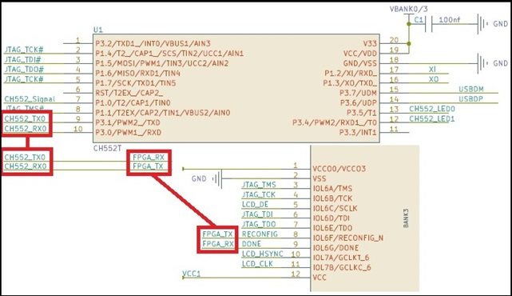

# Tang Nano 1kのUART
-----------

Tang Nano 1kはTnag Nanoの後継としてSipeedから発売されました。  
両製品ともGOWIN Semiconductor製で、LUTのサイズが1k程度の小規模なFPGAを搭載しています。  
多くのTangシリーズのGOWIN製のFPGAは、Gowin IEDのEducationバージョンでサポートされていますが、  
Tang NanoのGW1N-LV1QN48C6/I5は未サポートのままで、AliexressのSipeedのストア商品ページからも無くなっています。  
Tang NanoにはPSRAMが実装されていたり、UARTがあったりと、Tang Nano 1kで無くなった機能がありました。  

  Tang NanoにはUSB-JTAG変換用のチップCH552にUARTチャネルがあり、これがFPGAに接続されています。  

  Tang Nano 1kのBL702ではUARTの端子の記載がありません。  
  
　PCと接続するBL702にはUSB、JTAGと数本のGPIOピンがあるのみで、FPGAのプログラム用途の機能しかないかと思われます。  
　しかし、Tang Nano 1kとPCを接続する前と後でデバイスマネージャーを比較すると、「UAB Serial Port」が追加されていることに気付きます。  
  
　また、「UAB Serial Port」のプロパティを確認すると、「USB Serial Converter B」に紐づいていることが分かります。  
  
　  
　  
　同じBL702を使用して、Debuggerに「Onboard USB-JTAG & USB-UART」を搭載するTang Nano 9kの回路と比較してみましょう。  
  
　Tang Nano 9kにおいては、BL702のGPIO_26がUARTのTX、GPIO_27がUARTのRXに設定されています。  
Tang Nano 1kのBL702においても、Tang Nano 9kでUARTとして使用しているGPIO_26とGPIO_27がピンヘッダーへ結線されています。  
  
　  
　  
　これらのピンがUARTとして機能するかどうか確かめます。  
　「・」が付いた26ピンと27ピンをショートして、送信端子と受信端子を繋げます。  
  
  
　TeraTermを使用し、Tang Nano 1k接続時に追加されるシリアルポートをオープンします。  
TeraTermの設定でローカルエコーにチェックを入れ、英数字を入力します。  
  
　ローカルエコーによって入力された文字と、UARTで受信したデータが表示されます。  
同じ文字が2個続けて表示されます。  
　  
　  
このように、Tang Nano 1kでは、UARTが廃止されたわけではなく、回路図に明確に記述されていませんが、  
  **GPIO_27**に**RX**、**GPIO_26**に**TX**が割り当てられています。  
ここまで説明した通り、Tang Nanoと同様に、Tang Nano 1kでもUARTを使って、FPGAとPCの間で通信することが可能です。  
　  
　  
以上。  
    
　 　 　 　著　Yoshiyuki Takeda

